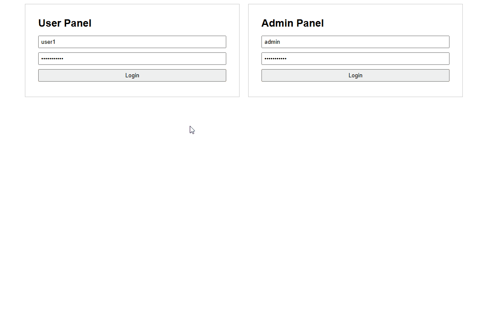

# 📈 StockPulse – Real-time Stock Price Alerts

StockPulse is a backend-driven stock monitoring and alert system built with **.NET**. Users can register alerts for price thresholds (above/below), and receive real-time notifications via SignalR when a condition is met.



---

## ✨ Features

- 🛎️ Register alerts for AAPL, GOOGL, MSFT, TSLA
- 🔔 Receive real-time SignalR notifications when thresholds are hit
- 🧪 Admin panel to simulate price changes manually
- ⏱️ Background simulation (toggleable via config)
- 🧠 Redis caching + distributed locking to prevent concurrency issues
- 📩 MassTransit with RabbitMQ for scalable alert evaluation
- 🐳 Dockerized with SQL Server, Redis, RabbitMQ, and full UI

---

## 🛠️ Configuration

### 🔄 Enable/Disable Simulator

Controlled via `appsettings.json`:

```json
"EnableBackgroundSimulator": false
```

- `false`: Use Admin panel for manual price pushes.
- `true`: System simulates prices every 15 seconds.

### 📊 Supported Stock Symbols

```json
"Symbols": [ "AAPL", "GOOGL", "MSFT", "TSLA" ]
```

These are the only valid symbols for alerts or simulations.

---

## 🧱 Project Structure

```
StockPulse/
├── StockPulse.API/            # Main Web API
│   ├── Controllers/           # Alert, Auth, StockPrice endpoints
│   ├── Extensions/            # Middleware, DI, JWT setup
│   ├── Services/              # RedisCacheService, MemoryCacheService, SignalR
│   └── appsettings.json       # Configuration (symbols, simulator toggle)
│
├── StockPulse.Application/    # Business logic
│   ├── Interfaces/            # Service abstractions
│   ├── Services/              # Alert evaluation, simulator, publisher
│   └── DTOs/Models/Enums/     # Request, Result, Enum classes
│
├── StockPulse.Infrastructure/ # Messaging & Consumers (MassTransit, RabbitMQ)
│
├── StockPulse.IntegrationTests/
│   ├── Tests/                 # Alert, Notification, Evaluator tests
│   └── Helpers/Fixtures/      # Setup and fake classes
│
├── StockPulse.UI/             # Simple HTML UI for user/admin
│
├── docker-compose.yml         # Containers for API, SQL, Redis, RabbitMQ
└── README.md
```

---

## 🚀 Running the App

```bash
docker-compose up --build
```

This launches the following services:

- `stockpulse-api`: .NET Web API
- `db`: SQL Server
- `redis`: Redis cache
- `rabbitmq`: Message bus
- `ui`: Basic HTML panel for demo

Accessible URLs:

- UI: http://localhost:8080
- Swagger: http://localhost:5000/swagger
- RabbitMQ Dashboard: http://localhost:15672 (guest / guest)

---

## 🧪 Testing

Integration tests for:

- Alert creation and evaluation
- Notification delivery via SignalR
- Race condition detection (with and without Redis lock)

To run tests:

```bash
dotnet test StockPulse.IntegrationTests
```

---

## 🧠 Design Considerations

- **Concurrency**: Optimistic concurrency with `RowVersion`, distributed locking via Redis (`RedLockNet`)
- **Scalability**: Pub/sub via RabbitMQ, batch evaluation, per-alert locking to avoid double notifications
- **Extensibility**: DI-first architecture, modular service layers, open to multi-user/tenant setups

> While RabbitMQ and Redis locking may seem like overengineering for a demo, they were intentionally chosen to simulate production-level concurrency and scalability challenges.

---

## 🧭 Future Enhancements

- Use real stock price APIs (e.g., Alpha Vantage, Yahoo Finance)
- Replace in-memory users with IdentityServer or OAuth
- Persist alerts to separate read/write models (CQRS)
- UI refinement & progressive WebSocket fallback
- Add health checks and readiness/liveness probes for container orchestration
- Use Polly for transient fault-handling (e.g., retry logic on external API failures)
- Enable API versioning and Swagger grouping for future scalability
- Add metrics (e.g., Prometheus, OpenTelemetry) for observability and performance tracking
- Refactor into microservices (e.g., AlertService, PriceService, NotificationService) to improve scalability and independent deployment

---